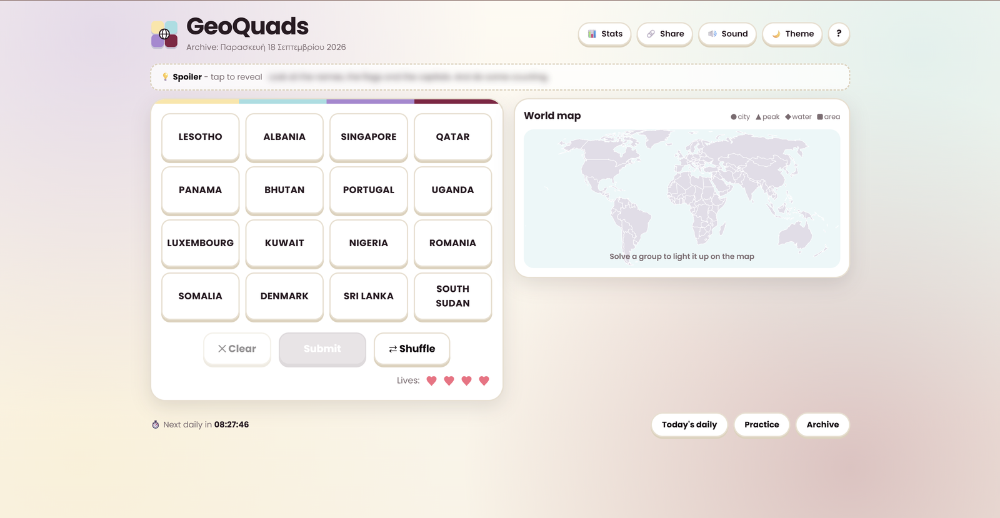

# GeoQuads

A daily geography grouping puzzle. Sixteen words (countries, cities, islands, landmarks) hide four groups of four. Find all four groups before you run out of lives.

**Play it:** https://geoquads.vercel.app/



## How to play

1. You get a 4x4 grid of 16 words. Each word belongs to exactly one of four hidden categories (for example *capitals*, *islands*, *countries on the equator*).
2. Click a word to select it. Select four words that you think share a category, then press **Submit**.
3. **Correct:** the four words merge into a banner at the top and the grid shrinks (4x4, then 3x4, and so on).
4. **Wrong:** the selection is cleared and you lose a life. If your guess was only **one word away**, the game tells you.
5. Lose all your lives and the remaining categories are revealed one by one.
6. Stuck? Tap the blurred **Spoiler** box for a vague hint (it never names the category outright).

| Control | What it does |
|---|---|
| **Clear** (`Esc`) | Deselects every selected word |
| **Submit** (`Enter`) | Enabled only when exactly 4 words are selected |
| **Shuffle** (`R`) | Rearranges the remaining words |
| **?** | Shows the instructions |
| **Stats** | Played, win rate, current and best streak |
| **Share** | Copies your result as an emoji grid |
| **Theme** | Switches between light and dark mode |
| **Sound** | Toggles soft sound effects (off by default) |

## Features

- New **daily puzzle** every day, with a countdown to the next one (resets at local midnight)
- **Practice** rounds (easy and hard) that don't affect your stats
- **Archive** of past dailies, with a marker on the ones you solved or failed
- A finished daily stays finished when you reload the page
- **World map that lights up**: every solved group lights its countries on a world map (cities, peaks, seas and areas appear as pins) and the map zooms to them
- Optional 💡 fun fact for each group (add a `fact` field in the quiz JSON)
- **Stats chart**: how many of your quizzes were solved with 0, 1, 2, 3 mistakes (or lost), plus best streak
- **Dark / light theme** (follows your system, or switch with the theme button)
- **Installable app (PWA)**: add it to your phone's home screen; the game shell works offline once loaded
- Link previews (Open Graph image) when the game is shared in chat apps
- Win streak counter, confetti and a colored recap of your guesses
- "One away" feedback, lives counter, spoiler hints, shareable results, sound toggle
- Responsive layout that works on phones
- Quizzes are plain JSON files, checked by a **validation script**

## Tech stack

- Vanilla **JavaScript** (ES modules), **HTML** and **CSS**, no framework and no build step
- Quizzes stored as **JSON** files, one per day
- **Node.js** scripts to validate quizzes and build the quiz index
- **Service worker** + web manifest (PWA)
- **Node.js test runner** for unit tests (`npm test`)
- Deployed on **Vercel**

## Project structure

```
index.html            page markup
css/style.css         styles (colors are CSS variables at the top)
js/
  app.js              UI and game flow
  logic.js            pure game rules (no DOM), easy to unit test
  storage.js          localStorage wrapper (stats, results, settings)
  sound.js            sound effects
  map.js              the world map (drawing only)
  confetti.js         win animation
quizzes/
  YYYY-MM-DD.json     one daily puzzle per date
  practice-*.json     practice puzzles
  index.json          list of available quizzes (generated)
scripts/
  validate-quizzes.mjs   checks every quiz file
  build-index.mjs        regenerates quizzes/index.json
  build-map.mjs          regenerates assets/map-data.json
data/
  countries-110m.geojson  country outlines (Natural Earth, public domain)
  places.json             where each quiz item is on the map (our own list)
assets/               favicon + generated map-data.json
docs/                 README images
```

## Run it locally

```bash
git clone https://github.com/markapaa/geoquads-demo.git
cd geoquads-demo
npm start
```

Then open the address printed in the terminal. The game uses ES modules and loads JSON files, so it must be served over HTTP; opening `index.html` directly from disk will not work.

## Adding a new daily quiz

1. Copy an existing file in `quizzes/` and rename it to the date, e.g. `2026-10-01.json`. The `id` inside must match the file name.
2. Fill in four categories with four unique items each, plus a `spoiler` hint.
3. Update the index and validate:

   ```bash
   npm run build:index
   npm run build:map    # lists items that have no place on the map yet
   npm run validate
   ```

   Items whose name is a country (e.g. `Norway`) light up automatically. For anything else (cities, mountains, seas) add a line to `data/places.json`, e.g. `"Hanoi": { "lat": 21.03, "lon": 105.85, "kind": "city" }`. Use `"Nile@Rivers of Africa"` to apply an entry only inside one group.

The dailies currently run from 2026-09-01 to 2026-09-30.

## Changing the colours

Every colour lives in the `:root` block at the top of `css/style.css` (`--group-0` to `--group-3` are the four group colours; the confetti, logo and map use them too). Edit those values and nothing else needs to change.

## Credits

Country outlines: [Natural Earth](https://www.naturalearthdata.com) (public domain). Pin positions are approximate.

## Roadmap

- [ ] Automated tests for the game logic, run in CI with GitHub Actions
- [ ] Medium-difficulty practice quiz
- [ ] Optional accounts, personal statistics and a leaderboard (backend + database)
- [ ] Revise mode: replay the groups you missed

## Author

Made by [Margieta Kokkinou](https://github.com/markapaa) as a personal project.
